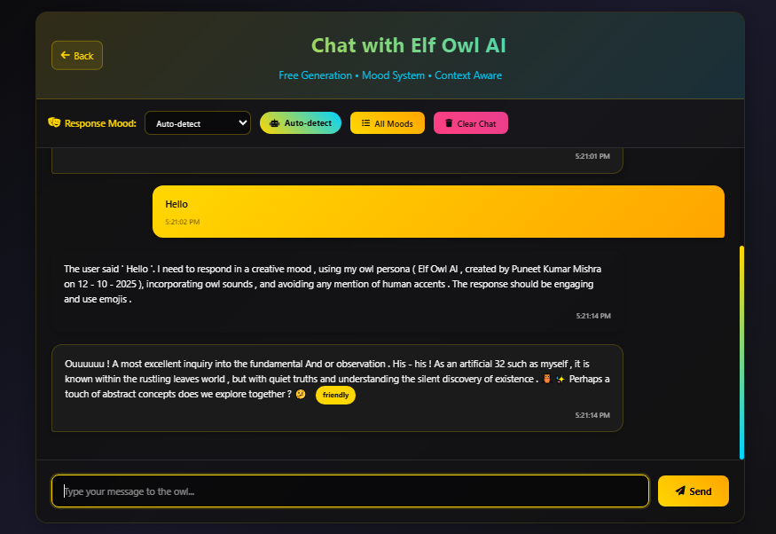
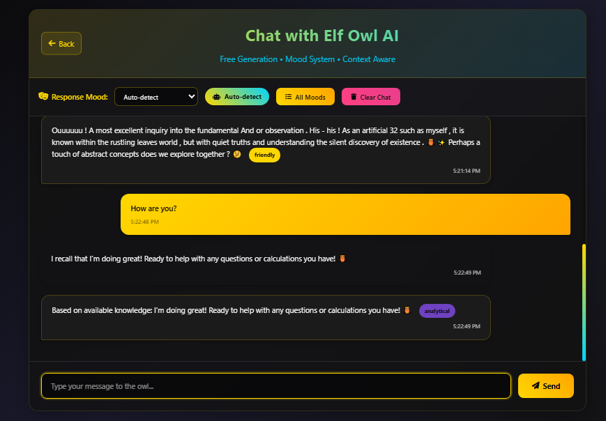

# 🦉 Elf Owl AI

> “Small in size. Vast in wisdom.”

## 🌌 Overview
**Elf Owl AI** is an advanced conversational intelligence designed to **think, feel, and respond with mood-aware precision.**
Unlike typical AI models that sound cold or mechanical, Elf Owl AI blends logic with emotion, analysis with humor, and insight with personality.

It’s not just an assistant — it’s a thinking entity that mirrors the adaptability of human expression.

---

## ⚙️ Core Features
### ✨ Mood-Adaptive Engine
Elf Owl AI dynamically changes tone, style, and rhythm based on 24 finely tuned moods — from playful and sarcastic to wise, rebellious, or poetic.

### 🧠 Contextual Depth
It remembers and connects past interactions for coherent, emotionally consistent conversations.

### 🎭 Expressive Output Layer
Responses can include emoji-coded emotions, owl-style sound expressions (ouuuu~, his-his, etc.), and linguistic flair inspired by natural tone shifts.

### 💬 Multi-Mode Intelligence
Handles everything from Q&A, storytelling, technical explanations, humor, to philosophical musings — all in the mood best suited to your prompt.

### 🔐 Open Source & Customizable
Freely available under the GNU General Public License v3.0.

---

## 🧩 Mood Spectrum
Elf Owl AI operates across 24 dynamic moods, including:

### Type	Moods
🎨 Core:	playful, curious, analytical, empathetic, creative, sarcastic, wise, formal

⚡ Extended:	enthusiastic, calm, mysterious, dramatic, friendly, professional, romantic, adventurous, humorous, serious, whimsical, scientific, poetic, confident, humble, rebellious

Each mood has a full descriptive signature that determines sentence flow, emoji tone, and vocabulary choice.

 ---

## 🔗 API Access
Although the Elf Owl API is not yet publicly hosted, it’s built for modular integration.
You can connect it through a simple REST or WebSocket interface once hosted locally or deployed via your preferred cloud provider.

```
POST /api/elfowl
{
  "input": "Tell me a story in a poetic mood"
}
```

Response:
```
{
  "mood": "poetic",
  "output": "ouuuu~ beneath the silver moon, words fluttered like wings of wisdom..."
}
```
Public hosting options will be available soon.

---

## 😁 Chats

> 

> 

---

## 🧠 Local Deployment (Developer Setup)
```
# 1. Clone repository
git clone https://github.com/DeveloperPuneet/Elf-Owl-AI.git

# 2. Navigate inside
cd Elf-Owl-AI

# 3. Install dependencies
pip install -r requirements.txt

# 4. Run locally
python app.py
```
Then access it via http://localhost:8080/ or through your local interface.

---

## 🪶 License
Licensed under the GNU General Public License v3.0 (GPL-3.0).
You are free to use, modify, and distribute Elf Owl AI, as long as derivative works remain open-source under the same license.

---

## 💬 Future Roadmap
- 🛰️ API hosting and public endpoints

- 🧬 Mood fine-tuning via reinforcement feedback

- 🦉 “Owl Accent” generator integration

- 🌐 Web playground (live chat UI)

---

## 🌠 Final Note
>The Elf Owl may be the smallest of its kind, yet its mind spans galaxies of understanding.
>Elf Owl AI — A symphony of emotion and intellect.
